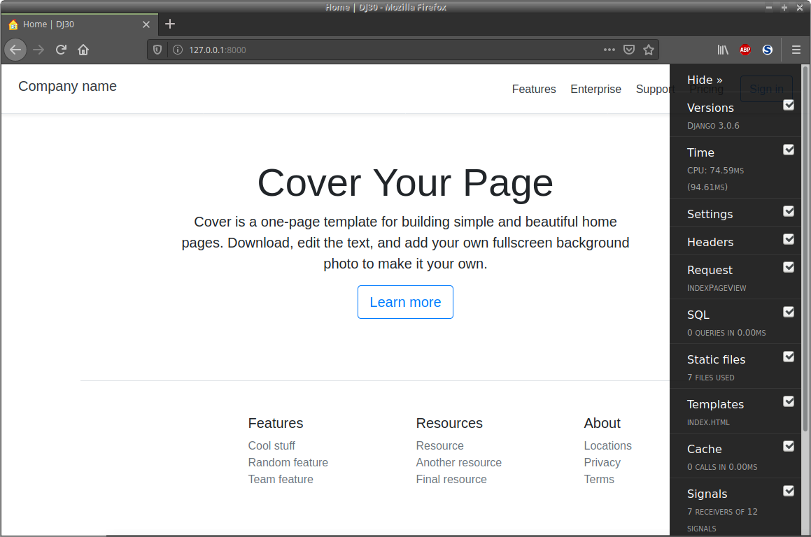

# Django_SU

> ***Django*** ***S***et ***U***p – *Quick* website start-up template.

## Features

* [Bootstrap](https://getbootstrap.com/) template styling
* Custom user model
* Separate development/production settings
* SQLite3 development database
* Static page app

## Requirements

* [Django](https://www.djangoproject.com/)
* [django-allauth](https://django-allauth.readthedocs.io/en/latest/)
* [django-debug-toolbar](https://django-debug-toolbar.readthedocs.io/en/latest/)
* [django-environ](https://django-environ.readthedocs.io/en/latest/)

## Installation

We are going to use the command line so open a terminal to get started.  Linux and Mac users will probably have `bash` or similar which will be fine, Windows users will have to make the necessary translations to follow along.

First let's check if Git is installed.  At the `$` prompt type `git --version` and press enter.  You should see something like `git version 2.xx.x`.  If not go to [Installing Git – the easy way](https://gist.github.com/derhuerst/1b15ff4652a867391f03) and follow the installation instructions for your system.

Now we'll clone this Git repo on your computer.  In the terminal enter `cd` to switch into your work directory then at the prompt type the following (replace `<my_project>` with the name you want):

```bash
git clone https://github.com/leeurbanek/Django_SU.git <my-project> && cd $_
```

That created a Git repository in the current directory named `<my-project>`, now `cd` into that directory.  This is the top level directory of the repo (it contains `manage.py` and `.gitignore`).

While we're in our top level directory let's setup the virtual environment.  We'll use Python's venv module to do this.  First, make sure Python 3 is installed.  At the prompt enter `python3 --version`.  You should see something like `Python 3.x.x` You must have version 3.3 or newer.  If not, you will have to install [virtualenv](https://pypi.org/project/virtualenv/) with pip install.

Now that the preliminaries are taken care of let's create the virtual environment.  At the prompt enter `python3 -m venv .venv` (note the 'dot' in front of venv).  To verify that the venv was created enter `ls -a` and look for the `.venv` directory.  Start the venv by entering `source ./.venv/bin/activate` at the prompt.  You will notice the prompt has changed.  While the venv is running let's upgrade a couple things.  Enter `pip install --upgrade pip setuptools wheel` at the prompt.  The pip environment is now up to date so we can install the dependencies our development server will need.  Type `pip install -r requirements/development.txt` to install.

Okay.  One last thing to do and then we're done. We have to setup the django-environ package to manage our project environmental variables.  Create the file `.env` in the top level dir. and open your editor `touch .env && nano .env`, press enter.  Copy and save the following into the `.env` file you just created then close the file.

```python
# django-environ
# https://pypi.org/project/django-environ/
DEBUG='off'
SECRET_KEY=<my-secret-key>
LANGUAGE_CODE='en-us'
TIME_ZONE='UTC'
```

Now create your own private secret key to replace `<my-secret-key>` above.  To do this, with your venv still running start an interactive Python3 shell by entering `python` at the prompt.  The prompt will change to a chevron `>>>`.  Enter the following:

```bash
from django.utils.crypto import get_random_string
chars = 'abcdefghijklmnopqrstuvwxyz0123456789!@#$%^&*(-_=+)'
print(get_random_string(50, chars))
```

Each time you execute the print statement above you will get a new random string.  Type `quit()` to exit Python and return to the venv.  Copy the new string (highlight it then `ctrl + shift + c`).  Re-open the .env file by typing `nano .env` at the prompt, then paste the new string `ctrl + shift + v` ovewriting `<my-secret-key>` in the .env file with the new key.  Save and close .env.

Quit the virtual environment by entering `deactivate` at the prompt.

## Configuration

Let's setup a few useful aliases (not required but will save a lot of typing later, you can skip to the **Usage** section below without loss if you prefer).  In the terminal enter `cd` to make sure we're in the home folder (the prompt will be something like `xx@xxx:~$` when you are).  We need to check if a couple files already exist. Enter `ls -a` don't forget the `-a`.  You should see a file named `.bashrc` and one named `.bash_aliases` if not you can create them by typing `touch .bash_aliases` for example.  Make double sure they do not exist before creating them.  If you are sure they don't exist, create them now.

If you did not have to create a `.bashrc` file, look at the existing file now by entering `cat .bashrc` at the prompt.  Check for the following lines:

```bash
if [ -f ~/.bash_aliases ]; then
    . ~/.bash_aliases
fi
```

If you find these lines don't change anything and close the `.bashrc` file.  Otherwise open a text editor and add those lines near the bottom of the file.  For example type `nano .bashrc` at the prompt.  Also, if you had to create a new `.bashrc` then add the lines to that file now.  Save and close the file.

With your text editor open the `.bash_aliases` file. This is where we create the aliases that you can use as shortcuts later. Add the following lines (near the bottom if the file already exists) to your `.bash_aliases` file:

```bash
# Django Stuff

# remove .pyc, .pyo files and __pycache__ directories
alias delpyc='\
  find . -type f -name "*.py[co]" -delete \
  -or -type d -name "__pycache__" -delete'

# start Django_SU virtual environment
alias Django_SU='\
  export PYTHONDODTWRITEBYTECODD=1 && \
  export DJANGO_SETTINGS_MODULE=project.settings.development  && \
  source ./.venv/bin/activate'

# quit virtual environment then clean-up directory
alias deact='deactivate && delpyc'

# django manage.py command aliases
alias djservd='python3 manage.py runserver'
alias djservp='python3 manage.py runserver --settings=project.settings.production'
alias djtest='python3 -Wa manage.py test'
alias djshell='python3 manage.py shell'
```

Don't change anything else.  Save and close `.bash_aliases` file.  To load your new settings enter `source .bashrc` at the prompt.

Whew!  That was a lot, but it will payoff later.  Notice that when we created the `Django_SU` alias we set the `DJANGO_SETTINGS_MODULE` environmental variable to the development settings file.  That way we don't need to include the `--settings` flag when using `manage.py` commands.  You will need to do something similar to this on the production server when you deploy your app.  We can still use `manage.py` instead of the aliases during development, but we will need to include the `--settings` flag similar to the `djservp` alias above.

## Usage

Open a terminal if it was closed.  Make sure you are in your project's top level directory, this is the directory that contains the `manage.py` file (enter `ls` to check).  If you setup the aliases as in the Configuration section above then to start the virtual environment just type `Django_SU` and to start the Django development server enter `djservd`.

If you did not setup the aliases above type `source ./.venv/bin/activate` to start the venv. Then to run the development server type:

```bash
python3 manage.py runserver --settings=project.settings.development
```

Remember since we use different settings for development and production every `manage.py` command must include the `--settings` flag and the location of the appropriate settings file.

Note: To quit the virtual environment type `deact` if you are using the aliases from above.  Else type `deactivate` at the prompt to quit.

Start your browser and go to [http://127.0.0.1:8000](http://127.0.0.1:8000).  If everything went right you will see a slightly modified Bootstrap 'Cover Your Page' template with the Django debug toolbar displayed on the right.



Now add pages, customize templates, create new apps and have fun!

## General Notes

To learn more about Django start with the very good free tutorial at [djangoproject.com](https://docs.djangoproject.com/en/3.0/).  After that, for a more advanced read try [Django For Professionals](https://djangoforprofessionals.com/), I found it very helpful also.

If you notice any errors, mistakes, or opportunities for improvement please let me know.
